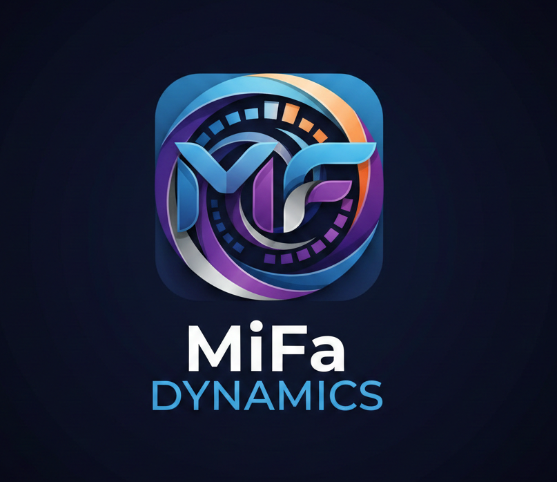

# MIFA Dynamics // Expert Simulation Engine



> **Reshaping the technical learning curve through procedurally generated intuition.**

MIFA Dynamics is a high-precision generative platform designed for the synthesis of complex technical simulations. By leveraging a specialized multi-agent LLM architecture, the platform interprets technical queries and renders executable simulation code in real-time, bridging the gap between abstract theory and deep-tech intuition.

---

## 🔬 Core Pillars

### Procedural Generation

Forget pre-rendered videos. MIFA generates unique mechanics and visual proofs on-demand, allowing for infinite topic coverage and custom technical queries.

### Multi-Agent Logic

Utilizes a decentralized multi-agent system to validate conceptual accuracy, ensure session persistence, and handle complex variable manipulations.

### Hybrid Visual System

A sophisticated rendering pipeline that delivers high-fidelity 3D experiences on desktop systems while maintaining lightning-fast, stable static mockups for mobile interaction.

---

## 🛠 Technical Architecture

- **Framework:** [Next.js 15+](https://nextjs.org/) (App Router)
- **Engine:** [React Three Fiber](https://r3f.docs.pmnd.rs/) / [Three.js](https://threejs.org/)
- **Animation:** [Framer Motion](https://www.framer.com/motion/)
- **Styling:** [Tailwind CSS 4](https://tailwindcss.com/)
- **Components:** [Shadcn UI](https://ui.shadcn.com/)
- **Runtime:** React 19 (Expert-validated concurrency)

---

## 🚀 Getting Started

### Prerequisites

- Node.js 20.x or later
- npm / pnpm / bun

### Installation

1. **Clone the repository:**

   ```bash
   git clone https://github.com/your-org/mifa-dynamics.git
   cd mifa-dynamics
   ```

2. **Install dependencies:**

   ```bash
   npm install
   ```

3. **Run the development laboratory:**

   ```bash
   npm run dev
   ```

4. **Access the Command Center:**
   Open [http://localhost:3000](http://localhost:3000)

---

## 📁 Project Structure

```text
mifa/
├── app/                  # Next.js App Router (Pages & Layout)
├── components/           # UI & Shared Components
│   ├── sections/        # High-level page sections (Hero, Solution, etc.)
│   ├── ui/              # Shadcn primitive components
│   └── visual/          # 3D Canvases & Technical visuals
├── lib/                  # Utility functions & core logic
├── public/               # Static assets & laboratory icons
└── styles/               # Global design tokens
```

---

## 🛡 Security & Integrity

MIFA Dynamics operates on a principle of **Least Privilege**. All conceptual queries and session logs are handled within secure technical silos, ensuring proprietary instructor designs remain confidential and expert-validated.

---

## 📮 Contact the Lab

For technical inquiries or API access requests:

- **Laboratory:** [mifa-dynamics.vercel.app](https://mifa-dynamics.vercel.app)
- **Support:** [Contact Support Lab](https://mifa-dynamics.vercel.app/#contact)

© 2026 MIFA Dynamics. All rights reserved.
